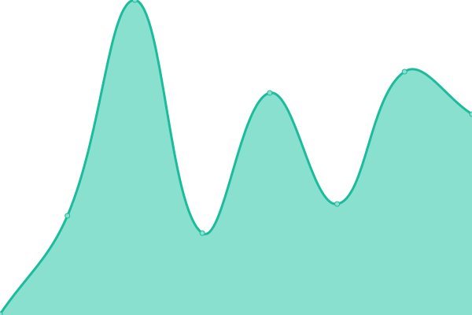
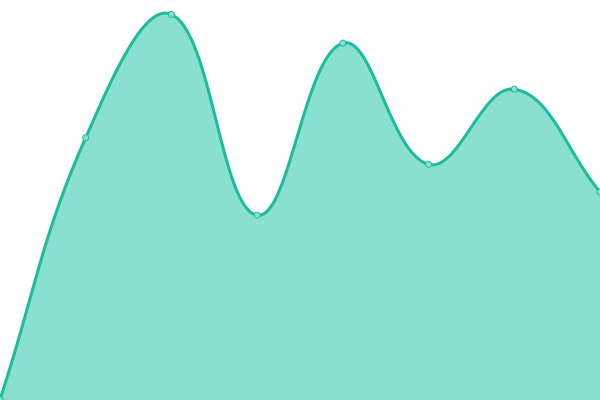
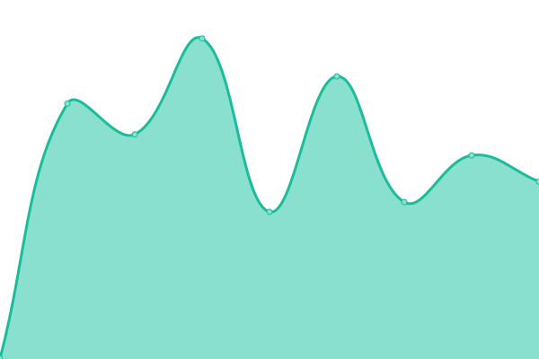

# [📈 Live Status](https://xibosignage.github.io/status-page): <!--live status--> **🟩 All systems operational**

This repository contains the open-source uptime monitor and status page for [Xibo Digital Signage](https://xibo.org.uk), powered by [Upptime](https://github.com/upptime/upptime).

With [Upptime](https://upptime.js.org), you can get your own unlimited and free uptime monitor and status page, powered entirely by a GitHub repository. We use [Issues](https://github.com/xibosignage/status-page/issues) as incident reports, [Actions](https://github.com/xibosignage/status-page/actions) as uptime monitors, and [Pages](https://xibosignage.github.io/status-page) for the status page.

<!--start: status pages-->
<!-- This summary is generated by Upptime (https://github.com/upptime/upptime) -->
<!-- Do not edit this manually, your changes will be overwritten -->
<!-- prettier-ignore -->
| URL | Status | History | Response Time | Uptime |
| --- | ------ | ------- | ------------- | ------ |
|  [Xibo Signage Website](https://xibo.org.uk) | 🟩 Up | [xibo-signage-website.yml](https://github.com/xibosignage/status-page/commits/HEAD/history/xibo-signage-website.yml) | 

 603ms
     
 | 

<a href="https://xibosignage.github.io/status-page/history/xibo-signage-website">100.00%</a>
    

|  Xibo Cloud United Kingdom/London | 🟩 Up | [xibo-cloud-united-kingdom-london.yml](https://github.com/xibosignage/status-page/commits/HEAD/history/xibo-cloud-united-kingdom-london.yml) | 

 286ms
     
 | 

<a href="https://xibosignage.github.io/status-page/history/xibo-cloud-united-kingdom-london">100.00%</a>
    

|  Xibo Cloud CDN United Kingdom/London | 🟩 Up | [xibo-cloud-cdn-united-kingdom-london.yml](https://github.com/xibosignage/status-page/commits/HEAD/history/xibo-cloud-cdn-united-kingdom-london.yml) | 

 396ms
     
 | 

<a href="https://xibosignage.github.io/status-page/history/xibo-cloud-cdn-united-kingdom-london">100.00%</a>
    

|  Xibo Cloud United States/New York | 🟩 Up | [xibo-cloud-united-states-new-york.yml](https://github.com/xibosignage/status-page/commits/HEAD/history/xibo-cloud-united-states-new-york.yml) | 

 121ms
     
 | 

<a href="https://xibosignage.github.io/status-page/history/xibo-cloud-united-states-new-york">100.00%</a>
    

|  Xibo Cloud CDN United States/New York | 🟩 Up | [xibo-cloud-cdn-united-states-new-york.yml](https://github.com/xibosignage/status-page/commits/HEAD/history/xibo-cloud-cdn-united-states-new-york.yml) | 

 161ms
     
 | 

<a href="https://xibosignage.github.io/status-page/history/xibo-cloud-cdn-united-states-new-york">100.00%</a>
    

|  Xibo Cloud Germany/Frankfurt | 🟩 Up | [xibo-cloud-germany-frankfurt.yml](https://github.com/xibosignage/status-page/commits/HEAD/history/xibo-cloud-germany-frankfurt.yml) | 

 289ms
     
 | 

<a href="https://xibosignage.github.io/status-page/history/xibo-cloud-germany-frankfurt">100.00%</a>
    

|  Xibo Cloud CDN Germany/Frankfurt | 🟩 Up | [xibo-cloud-cdn-germany-frankfurt.yml](https://github.com/xibosignage/status-page/commits/HEAD/history/xibo-cloud-cdn-germany-frankfurt.yml) | 

 400ms
     
 | 

<a href="https://xibosignage.github.io/status-page/history/xibo-cloud-cdn-germany-frankfurt">100.00%</a>
    

|  Xibo Cloud Singapore/Singapore | 🟩 Up | [xibo-cloud-singapore-singapore.yml](https://github.com/xibosignage/status-page/commits/HEAD/history/xibo-cloud-singapore-singapore.yml) | 

 506ms
     
 | 

<a href="https://xibosignage.github.io/status-page/history/xibo-cloud-singapore-singapore">100.00%</a>
    

|  Xibo Cloud CDN Singapore/Singapore | 🟩 Up | [xibo-cloud-cdn-singapore-singapore.yml](https://github.com/xibosignage/status-page/commits/HEAD/history/xibo-cloud-cdn-singapore-singapore.yml) | 

 787ms
     
 | 

<a href="https://xibosignage.github.io/status-page/history/xibo-cloud-cdn-singapore-singapore">100.00%</a>
    

|  Xibo Cloud Australia/Sydney | 🟩 Up | [xibo-cloud-australia-sydney.yml](https://github.com/xibosignage/status-page/commits/HEAD/history/xibo-cloud-australia-sydney.yml) | 

 457ms
     
 | 

<a href="https://xibosignage.github.io/status-page/history/xibo-cloud-australia-sydney">100.00%</a>
    

|  Xibo Cloud CDN Australia/Sydney | 🟩 Up | [xibo-cloud-cdn-australia-sydney.yml](https://github.com/xibosignage/status-page/commits/HEAD/history/xibo-cloud-cdn-australia-sydney.yml) | 

 751ms
     
 | 

<a href="https://xibosignage.github.io/status-page/history/xibo-cloud-cdn-australia-sydney">100.00%</a>
    

|  [Xibo Signage Customer Portal](https://app.xibo.org.uk) | 🟩 Up | [xibo-signage-customer-portal.yml](https://github.com/xibosignage/status-page/commits/HEAD/history/xibo-signage-customer-portal.yml) | 

 398ms
     
 | 

<a href="https://xibosignage.github.io/status-page/history/xibo-signage-customer-portal">100.00%</a>
    

|  Xibo Player License Service | 🟩 Up | [xibo-player-license-service.yml](https://github.com/xibosignage/status-page/commits/HEAD/history/xibo-player-license-service.yml) | 

 344ms
     
 | 

<a href="https://xibosignage.github.io/status-page/history/xibo-player-license-service">100.00%</a>
    

|  [Xibo Signage Blog](https://blog.xibo.org.uk) | 🟩 Up | [xibo-signage-blog.yml](https://github.com/xibosignage/status-page/commits/HEAD/history/xibo-signage-blog.yml) | 

 523ms
     
 | 

<a href="https://xibosignage.github.io/status-page/history/xibo-signage-blog">100.00%</a>
    

|  [Xibo Adspace Website](https://xibo-adspace.com) | 🟩 Up | [xibo-adspace-website.yml](https://github.com/xibosignage/status-page/commits/HEAD/history/xibo-adspace-website.yml) | 

 495ms
     
 | 

<a href="https://xibosignage.github.io/status-page/history/xibo-adspace-website">100.00%</a>
    

<!--end: status pages-->

[**Visit our status website →**](https://xibosignage.github.io/status-page)

## 📄 License

- Powered by: [Upptime](https://github.com/upptime/upptime)
- Code: [MIT](./LICENSE) © [Xibo Digital Signage](https://xibo.org.uk)
- Data in the `./history` directory: [Open Database License](https://opendatacommons.org/licenses/odbl/1-0/)
